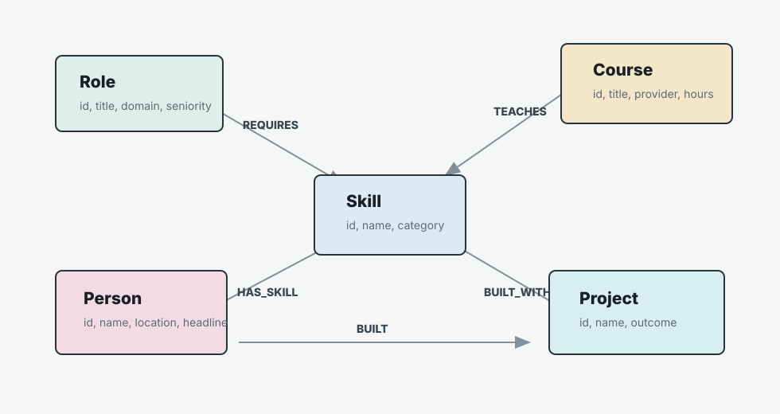

# SkillBridge Graph

SkillBridge Graph is a CognoDB-backed career transition explorer. A user picks a target role, marks the skills they already have, and the app finds graph paths to the courses, portfolio projects, and mentor candidates that bridge the remaining gaps.



## Why A Graph Database?

Career readiness is a relationship problem: roles require skills, courses teach skills, people have skills, and projects prove skills. The useful questions are rarely one-table lookups. They are path questions like "What courses teach the exact missing skills for this role?" and "Which people are close enough to this role to be useful mentors, and what projects prove that overlap?"

In a relational schema, these questions become chains of joins across role requirements, course coverage, people, skills, and project proof. In CognoDB, the model keeps those relationships first-class and the app can traverse from `Role -> Skill <- Course`, `Role -> Skill <- Person`, and `Person -> Project -> Skill` directly.

## App Features

- Target role and current skill selectors for non-technical users.
- Missing skill summary, bridge course recommendations, mentor matches, and portfolio project ideas.
- Relationship map rendered in the browser from the same graph-backed recommendation payload.
- Parameterized Cypher through the official `neo4j-driver`; user input is never concatenated into query strings.
- Graceful database-unreachable handling with a `503` API response and UI toast.
- Local demo mode for UI review before CognoDB credentials are available.

## Data Model

Nodes:

- `Role {id, title, domain, seniority}`
- `Skill {id, name, category}`
- `Person {id, name, location, headline}`
- `Course {id, title, provider, hours}`
- `Project {id, name, outcome}`

Relationships:

- `(Role)-[:REQUIRES]->(Skill)`
- `(Person)-[:HAS_SKILL]->(Skill)`
- `(Course)-[:TEACHES]->(Skill)`
- `(Project)-[:BUILT_WITH]->(Skill)`
- `(Person)-[:BUILT]->(Project)`

## Main Queries

The app query in [cypher/main-queries.cypher](cypher/main-queries.cypher) includes a multi-hop bridge traversal:

```cypher
MATCH (target:Role {id: $targetRoleId})-[:REQUIRES]->(missing:Skill)<-[:TEACHES]-(course:Course)
WHERE NOT missing.id IN $currentSkillIds
```

It also includes a relationally awkward recommendation query:

```cypher
MATCH (target:Role {id: $targetRoleId})-[:REQUIRES]->(skill:Skill)
MATCH (person:Person)-[:HAS_SKILL]->(skill)
OPTIONAL MATCH (person)-[:BUILT]->(project:Project)-[:BUILT_WITH]->(skill)
WITH person, collect(DISTINCT skill) AS matchedSkills, collect(DISTINCT project) AS proofProjects
WHERE size(matchedSkills) >= 2
```

That query scores mentor candidates by shared required skills and brings back proof projects along the same skill paths.

## Setup

1. Create a free CognoDB instance at [console.cognodb.com/signup](https://console.cognodb.com/signup).
2. Copy `.env.example` to `.env`.
3. Fill in:

```bash
COGNODB_URI=bolt+s://<instance-id>.databases.cognodb.cloud
COGNODB_USER=cognodb
COGNODB_PASSWORD=<password-shown-once>
```

4. Install dependencies:

```bash
npm install
```

5. Seed the graph:

```bash
npm run seed
```

6. Start the app:

```bash
npm start
```

Open `http://127.0.0.1:3000`.

## Demo Mode

To run the UI without a database:

```bash
USE_DEMO_DATA=true npm start
```

Demo mode uses the same shaped data as the seed script, but it does not write to CognoDB. It is intentionally opt-in. Without credentials and without `USE_DEMO_DATA=true`, the app shows an offline state.

If the header says `Demo graph`, the app is not using CognoDB. Stop the server and restart it without `USE_DEMO_DATA=true`.

For live CognoDB mode, `.env` should contain real credentials and `USE_DEMO_DATA=false`, then run:

```bash
npm run seed
npm start
```

The header should say `CognoDB connected`.

## Project Structure

- [src/server.js](src/server.js): Express routes and error handling.
- [src/graphRepository.js](src/graphRepository.js): CognoDB/Neo4j driver queries.
- [src/demoRepository.js](src/demoRepository.js): local fallback graph implementation.
- [scripts/seed.js](scripts/seed.js): constraints, nodes, and relationships loader.
- [public/app.js](public/app.js): browser interactions and SVG graph rendering.
- [cypher/main-queries.cypher](cypher/main-queries.cypher): documented Cypher examples.

## Screenshot

Add a current screenshot at `docs/screenshot.png` after launching the app. The browser automation surface was unavailable during this local build session, so the placeholder path is documented here for the final submission workflow.

## Deployment

Any Node-friendly free tier works. Set `COGNODB_URI`, `COGNODB_USER`, and `COGNODB_PASSWORD` as environment variables in the host. Keep `USE_DEMO_DATA=false` or unset for the hosted demo.

Recommended submission extras:

- Hosted app URL.
- Short screen recording showing role selection, skill toggles, recommendations, and graph changes.
